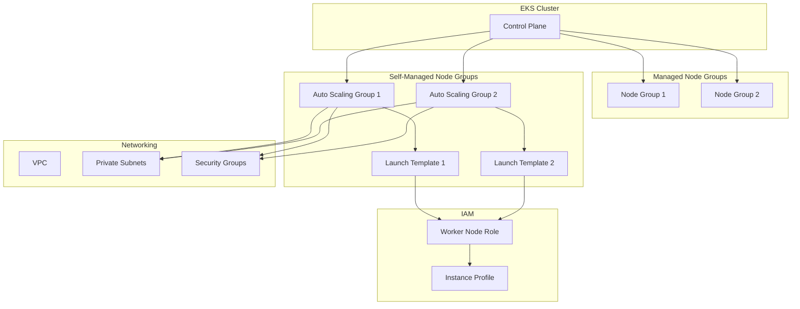

# Design Document: Self-Managed Node Groups for EKS

## Overview

This design extends the existing EKS Terraform infrastructure to support self-managed node groups alongside the current EKS managed node groups. The implementation will leverage Terraform's `terraform-aws-modules/eks/aws` module capabilities and add complementary resources for self-managed nodes.

The design maintains backward compatibility with existing managed node group configurations while providing the flexibility to deploy self-managed nodes with custom AMIs, advanced networking, and granular control over the EC2 instances.

## Architecture

### High-Level Architecture



### Component Integration

The self-managed node groups will integrate with the existing infrastructure:

1. **EKS Module Integration**: Utilize the existing EKS module's outputs for cluster endpoint, certificate authority, and security group IDs
2. **Networking Integration**: Deploy in the same VPC and subnets as managed node groups
3. **Security Integration**: Use existing security groups with additional self-managed specific rules if needed
4. **IAM Integration**: Create dedicated IAM roles for self-managed nodes with required EKS policies

## Components and Interfaces

### 1. Launch Template Component

**Purpose**: Define the EC2 instance configuration for self-managed nodes

**Key Features**:
- Custom or default EKS-optimized AMI selection
- Instance type and size configuration
- User data script for cluster joining
- EBS volume configuration
- Network interface settings

**Interface**:
```hcl
resource "aws_launch_template" "self_managed_nodes" {
  name_prefix   = "${local.cluster_name}-self-managed-"
  image_id      = var.self_managed_ami_id != "" ? var.self_managed_ami_id : data.aws_ami.eks_worker.id
  instance_type = var.self_managed_instance_types[0]
  
  vpc_security_group_ids = [
    module.eks.cluster_security_group_id,
    aws_security_group.app_test_worker_mgmt.id
  ]
  
  iam_instance_profile {
    name = aws_iam_instance_profile.self_managed_nodes.name
  }
  
  user_data = base64encode(templatefile("${path.module}/user_data.sh", {
    cluster_name        = local.cluster_name
    cluster_endpoint    = module.eks.cluster_endpoint
    cluster_ca_data     = module.eks.cluster_certificate_authority_data
    bootstrap_arguments = var.self_managed_bootstrap_arguments
  }))
}
```

### 2. Auto Scaling Group Component

**Purpose**: Manage the lifecycle and scaling of self-managed node instances

**Key Features**:
- Configurable min/max/desired capacity
- Multi-AZ deployment across private subnets
- Integration with EKS cluster for proper node registration
- Support for mixed instance types and spot instances

**Interface**:
```hcl
resource "aws_autoscaling_group" "self_managed_nodes" {
  name                = "${local.cluster_name}-self-managed-nodes"
  vpc_zone_identifier = module.vpc.private_subnets
  target_group_arns   = var.self_managed_target_group_arns
  health_check_type   = "ELB"
  
  min_size         = var.self_managed_min_size
  max_size         = var.self_managed_max_size
  desired_capacity = var.self_managed_desired_size
  
  launch_template {
    id      = aws_launch_template.self_managed_nodes.id
    version = "$Latest"
  }
  
  tag {
    key                 = "kubernetes.io/cluster/${local.cluster_name}"
    value               = "owned"
    propagate_at_launch = true
  }
}
```

### 3. IAM Component

**Purpose**: Provide necessary permissions for self-managed nodes to join and operate in the EKS cluster

**Key Features**:
- Worker node role with standard EKS policies
- Instance profile for EC2 instances
- Additional custom policies if specified

**Required Policies**:
- `AmazonEKSWorkerNodePolicy`
- `AmazonEKS_CNI_Policy`
- `AmazonEC2ContainerRegistryReadOnly`

**Interface**:
```hcl
resource "aws_iam_role" "self_managed_nodes" {
  name = "${local.cluster_name}-self-managed-node-role"
  
  assume_role_policy = jsonencode({
    Statement = [{
      Action = "sts:AssumeRole"
      Effect = "Allow"
      Principal = {
        Service = "ec2.amazonaws.com"
      }
    }]
    Version = "2012-10-17"
  })
}
```

### 4. User Data Script Component

**Purpose**: Bootstrap script to join self-managed nodes to the EKS cluster

**Key Features**:
- Cluster endpoint and CA certificate configuration
- kubelet configuration
- Docker/containerd setup
- Custom bootstrap arguments support

## Data Models

### Variable Structure

```hcl
# Self-managed node group configuration
variable "self_managed_node_groups" {
  description = "Map of self-managed node group configurations"
  type = map(object({
    ami_id                    = optional(string, "")
    instance_types           = optional(list(string), ["t3.medium"])
    min_size                 = optional(number, 1)
    max_size                 = optional(number, 3)
    desired_size             = optional(number, 2)
    capacity_type            = optional(string, "ON_DEMAND")
    subnet_ids               = optional(list(string), [])
    security_group_ids       = optional(list(string), [])
    bootstrap_arguments      = optional(string, "")
    user_data_template_path  = optional(string, "")
    additional_iam_policies  = optional(list(string), [])
    
    # EBS Configuration
    ebs_optimized = optional(bool, true)
    block_device_mappings = optional(list(object({
      device_name = string
      ebs = object({
        volume_size = number
        volume_type = string
        encrypted   = optional(bool, true)
      })
    })), [])
    
    # Tagging
    tags = optional(map(string), {})
  }))
  default = {}
}

# Enable/disable self-managed node groups
variable "enable_self_managed_node_groups" {
  description = "Whether to create self-managed node groups"
  type        = bool
  default     = false
}
```

### Output Structure

```hcl
output "self_managed_node_groups" {
  description = "Self-managed node group details"
  value = {
    for k, v in aws_autoscaling_group.self_managed_nodes : k => {
      arn                = v.arn
      name               = v.name
      launch_template_id = aws_launch_template.self_managed_nodes[k].id
      iam_role_arn       = aws_iam_role.self_managed_nodes[k].arn
    }
  }
}
```

## Error Handling

### 1. AMI Validation
- **Issue**: Invalid or non-existent AMI ID
- **Handling**: Use data source to validate AMI exists and fallback to latest EKS-optimized AMI
- **Implementation**: 
  ```hcl
  data "aws_ami" "eks_worker" {
    filter {
      name   = "name"
      values = ["amazon-eks-node-${var.kubernetes_version}-v*"]
    }
    most_recent = true
    owners      = ["602401143452"] # Amazon
  }
  ```

### 2. Instance Type Availability
- **Issue**: Specified instance types not available in target AZs
- **Handling**: Implement validation and provide clear error messages
- **Implementation**: Use data sources to check instance type availability

### 3. Subnet Configuration
- **Issue**: Invalid subnet IDs or subnets in wrong VPC
- **Handling**: Validate subnets belong to the EKS cluster VPC
- **Implementation**: Cross-reference with VPC module outputs

### 4. IAM Permission Issues
- **Issue**: Insufficient permissions for node registration
- **Handling**: Comprehensive IAM policy attachment with validation
- **Implementation**: Use aws_iam_role_policy_attachment resources with depends_on

### 5. Cluster Join Failures
- **Issue**: Nodes fail to join the cluster
- **Handling**: Detailed logging in user data script and CloudWatch integration
- **Implementation**: Enhanced bootstrap script with error reporting

## Testing Strategy

### 1. Unit Testing
- **Terraform Validation**: Use `terraform validate` and `terraform plan` for syntax and logic validation
- **Variable Validation**: Test all variable combinations and edge cases
- **Resource Dependencies**: Verify proper resource ordering and dependencies

### 2. Integration Testing
- **Multi-Node Group**: Test managed and self-managed node groups together
- **Scaling Operations**: Test auto-scaling group scale-up and scale-down
- **Node Replacement**: Test node termination and replacement scenarios

### 3. End-to-End Testing
- **Cluster Functionality**: Deploy sample applications across both node types
- **Network Connectivity**: Verify pod-to-pod communication across node groups
- **Service Discovery**: Test Kubernetes services work across all nodes

### 4. Security Testing
- **IAM Permissions**: Verify nodes have minimum required permissions
- **Network Security**: Test security group rules and network policies
- **Encryption**: Verify EBS encryption and in-transit encryption

### 5. Performance Testing
- **Node Join Time**: Measure time for nodes to become ready
- **Scaling Performance**: Test auto-scaling responsiveness
- **Resource Utilization**: Monitor CPU, memory, and network usage

### 6. Disaster Recovery Testing
- **AZ Failure**: Test behavior when an availability zone becomes unavailable
- **Node Failure**: Test automatic node replacement
- **Cluster Recovery**: Test cluster recovery after control plane issues

## Implementation Phases

### Phase 1: Core Infrastructure
- IAM roles and policies
- Launch template with basic configuration
- Auto Scaling Group with simple configuration

### Phase 2: Advanced Features
- Custom AMI support
- Mixed instance types and spot instances
- Advanced EBS configuration

### Phase 3: Integration & Optimization
- Enhanced monitoring and logging
- Advanced auto-scaling policies
- Cost optimization features

### Phase 4: Testing & Documentation
- Comprehensive testing suite
- Documentation and examples
- Migration guides from managed to self-managed nodes